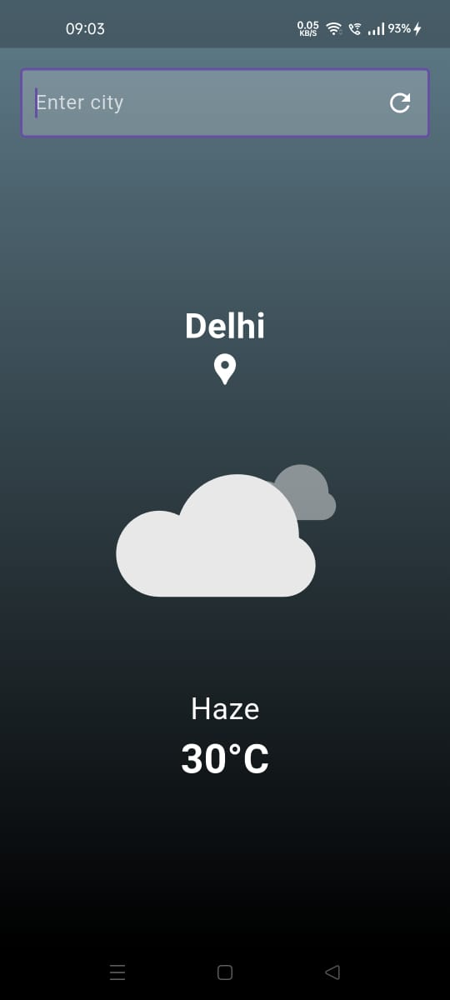
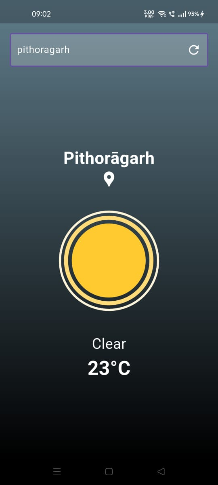

## Overview
Weather App Auto is a Flutter application that automatically fetches real-time weather data for the user's location using the OpenWeatherMap API and geolocation. It supports manual city input, displays weather conditions with Lottie animations, and features a minimal, gradient-based UI.

## Features
- Automatically retrieves weather data for the user's city using geolocation.
- Manual city input via a `TextField` with an integrated refresh button.
- Displays city name, temperature, and weather condition (e.g., "Clear", "Rain").
- Lottie animations for various weather conditions (sunny, cloudy, rainy, thunderstorm).
- Gradient blue-grey-to-black background for a sleek, full-screen design.
- Keyboard overlays content without resizing, ensuring a seamless typing experience.
- Robust error handling for location permission denials and API failures.

## Screenshots



## Setup
1. Clone the repository:
   ```bash
   git clone https://github.com/Vaibhav23rd/weather_app_auto.git
   ```
2. Install dependencies:
   ```bash
   cd weather_app_auto
   flutter pub get
   ```
3. Replace `YOUR_API_KEY` in `lib/services/weather_service.dart` with your OpenWeatherMap API key.
4. Ensure Lottie animation files (`sunny.json`, `cloudy.json`, `rainy.json`, `thunder.json`) are in the `assets/` directory.
5. Run the app:
   ```bash
   flutter run
   ```

## Dependencies
- `http: ^1.2.2` - For making API requests to OpenWeatherMap.
- `geolocator: ^13.0.1` - For accessing user location.
- `geocoding: ^3.0.0` - For converting coordinates to city names.
- `lottie: ^3.1.3` - For rendering weather condition animations.

## Notes
- Obtain an OpenWeatherMap API key from https://openweathermap.org/api and add it to `lib/services/weather_service.dart`.
- Location permissions are required for automatic weather fetching. If permissions are denied, manual city input is available.
- Ensure Lottie animation files are correctly placed in `assets/` to display weather animations.

## License
MIT License
